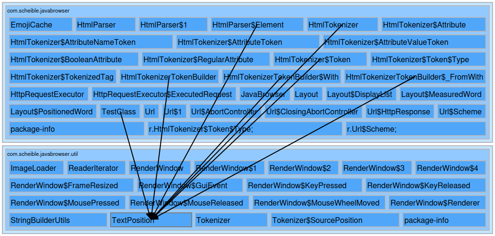
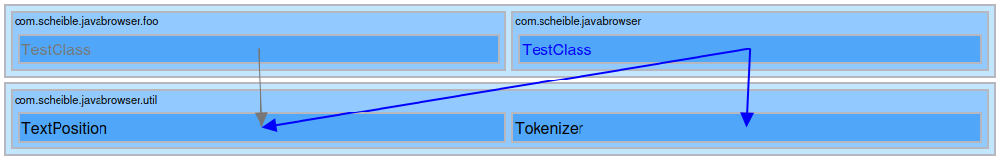

# ArchUnit Visualizer

```xml
	<dependency>
		<groupId>com.scheible</groupId>
		<artifactId>arch-unit-visualizer</artifactId>
		<version>1.0.0</version>
		<scope>test</scope>
	</dependency>
```

## Visualizations

### Package Layers

[Similar to Pocketsaw's package layer graph.](https://github.com/janScheible/pocketsaw?tab=readme-ov-file#motivation)

#### Full view

If the current Git branch is the reference branch `target/package-layers.html` contains a full view of all packages and classes.
Its purpose is to get an overview about an whole project.
The packages are expandable to allow a class-level view of the dependencies as well.



#### Diff view

If the current Git branch is not the reference branch `target/package-layers.html` contains a diff.
Removed dependencies and classes are colored gray.
Whilst added dependencies and classes are colored blue.
Its purpose is to see the structural changes between two branches.
The diff view is automatically refreshed every 3s and therefore is suitable to track changes while working on a new branch.



#### Usage

```java
class ArchUnitRenderTest {

	@Test
	void testArchUnitPackageLayerVisualization() throws IOException {
		JavaClasses classes = new ClassFileImporter().withImportOption(ImportOption.Predefined.DO_NOT_INCLUDE_TESTS)
			.importPackages(ArchUnitRenderTest.class.getPackageName());

		ArchUnitVisualizer.packageLayers(classes, "main", ArchUnitRenderTest.class);
	}

}
```

#### Build

To preserve the package layer graph data between builds.

```xml
	<plugin>
		<artifactId>maven-clean-plugin</artifactId>
		<version>3.5.0</version>
		<configuration>
			<excludeDefaultDirectories>true</excludeDefaultDirectories>
			<filesets>
				<fileset>
					<directory>target</directory>
					<includes>
						<include>**/*</include>
					</includes>
					<excludes>
						<exclude>package-layers*.json</exclude>
						<exclude>package-layers.html</exclude>
					</excludes>
				</fileset>
			</filesets>
		</configuration>
	</plugin>
```
